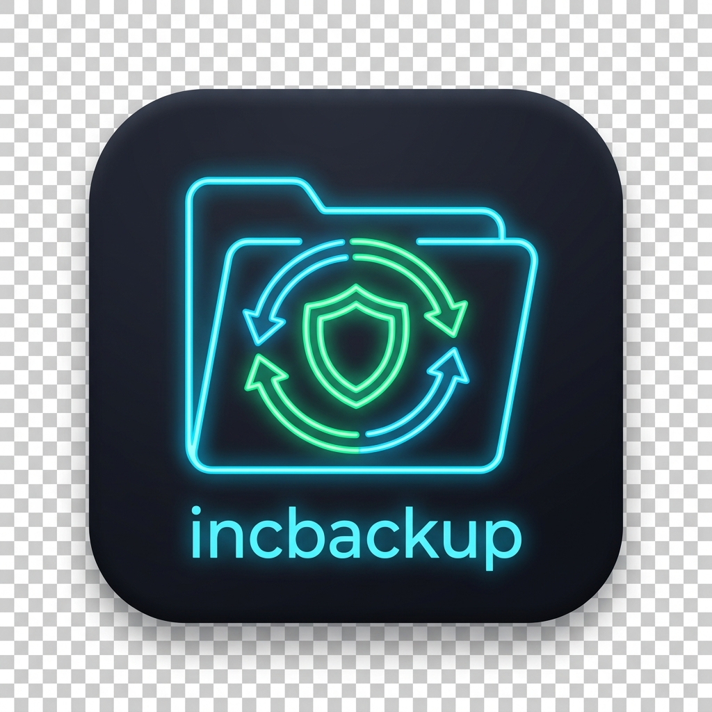

# Unraid Incremental Backup Plugin



A lightweight, fully automated, and highly efficient incremental backup plugin for Unraid. `incbackup` uses standard `rsync` with hardlink technology to ensure that your backups take up minimal space while maintaining full, explorable backup directories for every snapshot.

## Features
- **Hardlink Efficiency**: Only changed files consume new disk space. Unchanged files are seamlessly linked to the previous backup, saving massive amounts of storage.
- **Background Automation**: Reliable, independent Cron scheduling that runs in the background without blocking Unraid's operations or hanging your WebUI.
- **AJAX Live Logging**: Watch your backups in real-time with an integrated, asynchronous log viewer right in the Unraid settings page.
- **Smart Retention**: Automatically prunes older backups based on your custom retention limit.
- **Custom Directory Picker**: Easily select source and destination paths via an integrated, fast directory browser.
- **Disk Usage Validator**: A built-in feature to calculate the *true* storage usage of your backups (taking hardlinks into account, unlike Windows Explorer).

## Installation
Currently, you can install this plugin manually via the Unraid terminal:
```bash
plugin install https://raw.githubusercontent.com/DEIN_GITHUB_NAME/unraid-incbackup-plugin/main/incbackup.plg
```
*(Replace `DEIN_GITHUB_NAME` with your actual GitHub username once published!)*

## Configuration
After installation, navigate to **Settings -> Incremental Backup** in your Unraid WebUI.
1. Enable the background job.
2. Set your desired retention limit (e.g., 7 versions).
3. Configure your cron schedule (Daily, Weekly, etc.).
4. Add your Source and Destination folder pairs.
5. Hit **"Einstellungen Speichern"** to lock the cron job into your system.

### Important Note on Hardlinks
For the incremental storage savings to work, Unraid must permit hardlinks.
Ensure that in your Unraid Global Share Settings, the option **"Permit Hardlinks"** is enabled if you are backing up across user shares.

## Contributing & Support
Feel free to open an Issue or Pull Request if you'd like to improve the codebase.
For plugin support, please visit the official Unraid Forums [Link to your Support Thread].
